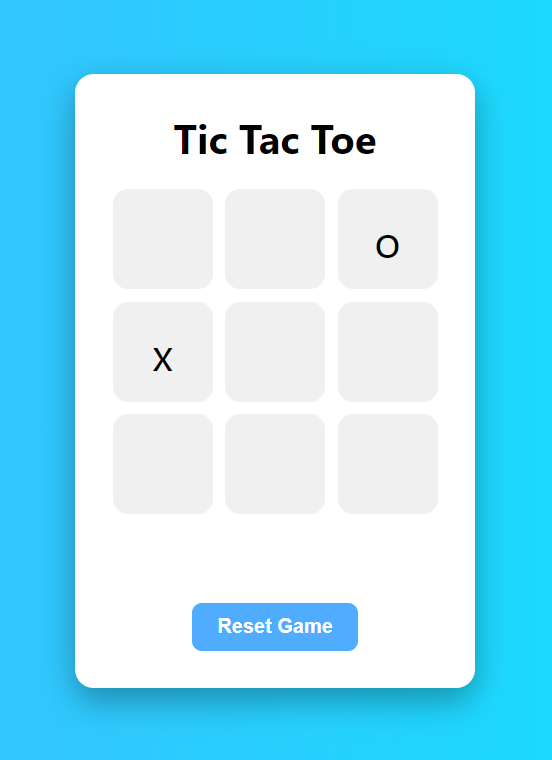

---

## ✅ Features

- Two-player turn-based game logic
- Winner and draw detection
- Real-time UI updates
- Reset functionality
- Clean, responsive design using flexbox

---

## 🚀 How to Run

1. Clone or download this repository.
2. Open `index.html` in any modern web browser.
3. Click on the grid boxes to play the game.
4. Use the **Reset** button to start a new round.

---

## ✨ Preview

---

## 🔧 Technologies Used

- HTML5
- CSS3 (Flexbox)
- JavaScript (ES6)

---

## 📌 Notes

- This version is built for local browser play only.
- Can be extended to add AI for single-player mode in the future.

---

## 🧑‍💻 Author

Created by [aryan sojitra]  
Feel free to contribute or fork this project.

